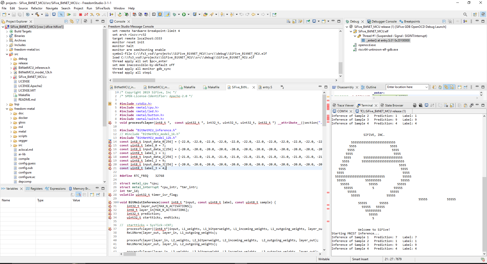

# Edge AI Implementation on SiFive HiFive1-Based VSDSquadron Pro
This project explores the implementation of Deep Neural Networks (DNNs) 
on the VSDSquadron Pro board powered by the 
SiFive-HiFive-1 FE310-G002 microcontroller. 

<hr>

Target Specification:- 
- **Development Board**:- VSDSquadron Pro
- **IC**:- SiFive FE310-G002 
- **Frequency** :- 320 MHz
- **SRAM** :- 16 kb
- **SPI Flash** :- 32 Mb
- **Architecture**:- rv32imac_zicsr_zifencei
- **Tool Suit**:- riscv64-unknown-elf-toolsuite-2.0.3
- **Software Used**- Sifive Freedom Studio

<hr>

## Bitnet Implementation
This approach leverages model compression to enable the deployment of compact models on constrained hardware like the VSDSquadron Pro.


### Features:- 
- Supports any model with dense (fully-connected) and ReLU layers.
- Models can be generated using PyTorch.
- Both self-generated and pre-trained models with dense and ReLU layers are deployable.


### Steps for Deployment:- 
1. Generate a model using [BitNet MCU model generation](sifive_bit_net_implementation\bitnetmcu_model_generation/BitNetMCU/)
    - Example: An MNIST Classification project demonstrates this.
2.	Copy the generated model file to the [source folder of the SiFive BitNet MCU project.](sifive_bit_net_implementation\SiFive_BitNET_MCU\src) 
3.	Update the [SiFive_BitNET_MCU.c](sifive_bit_net_implementation\SiFive_BitNET_MCU\src\SiFive_BitNET_MCU.c) file to point to the correct model.
4.	Open the project in SiFive Freedom Studio and debug using its inbuilt compiler.


### Generated Prediction Output 


### Example Use Case
To classify handwritten digits (MNIST dataset), compress a dense neural network with ReLU layers using BitNet. This results in a small model deployable within the memory limits of the VSDSquadron Pro board.

### Real-Time Applications
The BitNet approach focuses on compact and efficient neural network deployment, making it ideal for applications with constrained resources:
- Wearable Devices: Fitness trackers for activity recognition and calorie counting.
- IoT Sensors: Smart home devices with speech keyword spotting and real time Optical Character Recognizer(OCR)
- Industrial Monitoring: Lightweight systems for detecting anomalies in equipment operations.
<hr>

## Tensorflow Lite Micro (TFLM) Implementation
**Note**: This is under development and not yet fully deployable.

This approach facilitates the prediction of models with various layer types using the TensorFlow Lite Micro library.


### Features:- 
- Compatible with models containing all types of layers and activations.
- Uses TensorFlow in Python to create models and compress them into .tflite format.
- Deploys models constrained by SRAM and flash size.


### Ongoing Development
Current challenges include limitations in the tool suite’s floating-point library. View the complete [error log here](./sifive_tensorflow_lite_micro_implementation/error_log.txt).

### Steps for Deployment
1.	Generate your model using TensorFlow in Python.
    - Example: [TFLM sine wave prediction](https://ai.google.dev/edge/litert/libraries/modify).
2.	Convert the model to .tflite format using TensorFlow's [TFLite Model Maker](https://ai.google.dev/edge/litert/libraries/modify).
3.	Use the [tflite_to_c.py](./sifive_tensorflow_lite_micro_implementation/tflite_to_cc.py) script to create model.cc and model.h files. 
4.	Copy the .cc and .h files into the [project's source folder](./sifive_tensorflow_lite_micro_implementation/sifive_hifive1_empty_1/src/).
5.	Generate a micro resolver for the model using [micro_op_resolver](https://github.com/tensorflow/tflite-micro/tree/main/tensorflow/lite/micro/tools/gen_micro_mutable_op_resolver).
6. Update the [main.cpp](./sifive_tensorflow_lite_micro_implementation/sifive_hifive1_empty_1/src/main.cpp) file to import the correct model and resolver.
7. Add the  [TensorFlow Lite library directory](./sifive_tensorflow_lite_micro_implementation/sifive_hifive1_empty_1/tflite/) to the project path.
8.	Open the project in SiFive Freedom Studio and update the makefile to resolve imports.

**Example Makefile Updates :-**

```Makefile
...
#############################################################
# Software
#############################################################

PROGRAM_ELF ?= $(SRC_DIR)/$(CONFIGURATION)/$(PROGRAM).elf
PROGRAM_HEX ?= $(SRC_DIR)/$(CONFIGURATION)/$(PROGRAM).hex
PROGRAM_LST ?= $(SRC_DIR)/$(CONFIGURATION)/$(PROGRAM).lst

.PHONY: all
all: software

.PHONY: software
software: $(PROGRAM_ELF)

software: $(PROGRAM_HEX)

tflm_dir= $(PWD)/tflite
PROGRAM_SRCS = $(wildcard $(SRC_DIR)/*.c) $(wildcard $(SRC_DIR)/*.h) $(wildcard $(SRC_DIR)/*.hpp) $(wildcard $(SRC_DIR)/*.S)$(wildcard $(SRC_DIR)/*.cpp)$(wildcard $(SRC_DIR)/*.cc)
TFLM_INCLUDE_DIRS := $(shell find $(tflm_dir) -type d)
#RISCV_CFLAGS += -lgcc -lc -msoft-float
RISCV_CXXFLAGS += -lgcc -lc 
RISCV_LDLIBS += -L$(tflm_dir) -ltflite 
RISCV_LDFLAGS += $(addprefix -I, $(TFLM_INCLUDE_DIRS))
RISCV_LDFLAGS += -fno-rtti 

```

### Real-Time Applications
Below is a snippet showcasing essential additions to the makefile:
TFLM extends the capability to more complex models, supporting diverse layers and larger datasets, suitable for:
- **Edge AI Cameras**: Real-time object detection and facial recognition in security systems.
- **Healthcare Gadgets**: Devices like portable ECG or blood oxygen level monitors using AI for diagnostics.
- **Consumer Electronics**: Voice assistants and gesture-controlled devices in smart environments.
